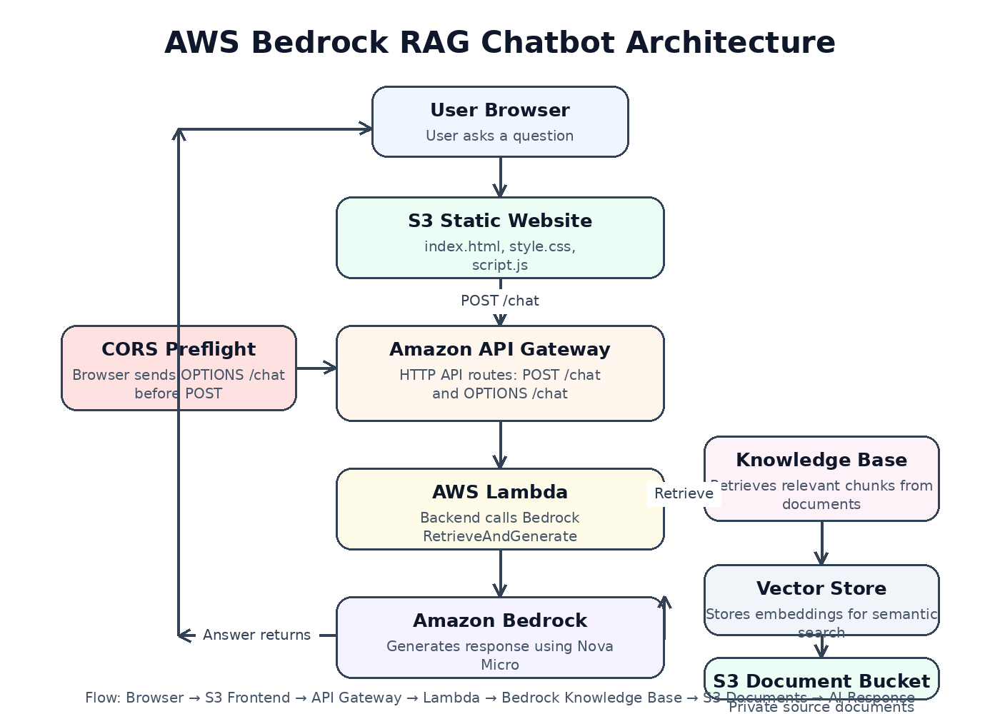

# AWS Bedrock RAG Chatbot

A serverless, document-based AI chatbot built on AWS using **Amazon Bedrock**, **Bedrock Knowledge Bases**, **Amazon S3**, **AWS Lambda**, and **Amazon API Gateway**.

This project demonstrates how to build a Retrieval-Augmented Generation (RAG) chatbot that can answer questions based on private documents stored in Amazon S3.

---

## Project Overview

The purpose of this project is to build a practical Generative AI application on AWS.

The chatbot allows users to ask questions through a simple web interface. The frontend sends the user's question to an API Gateway endpoint. API Gateway triggers an AWS Lambda function, and the Lambda function calls Amazon Bedrock Knowledge Bases using the `RetrieveAndGenerate` API.

Amazon Bedrock retrieves relevant information from the connected S3 document source and generates an AI-powered response using a foundation model.

---

## Architecture



```text
User Browser
    ↓
S3 Static Website Frontend
    ↓
Amazon API Gateway
    ├── OPTIONS /chat  → CORS preflight request
    └── POST /chat     → Chatbot request
    ↓
AWS Lambda
    ↓
Amazon Bedrock Knowledge Base
    ↓
Vector Store
    ↓
Amazon S3 Document Bucket
    ↓
Amazon Nova Micro Foundation Model
    ↓
AI-generated response
```

---

## AWS Services Used

### Amazon S3

This project uses two S3 buckets.

#### 1. Document Bucket

The document bucket stores the source documents used by the Bedrock Knowledge Base.

Example document:

```text
gokhan-profile-cloud-engineer.txt
```

#### 2. Frontend Bucket

The frontend bucket hosts the static website files.

Frontend files:

```text
index.html
style.css
script.js
```

---

### Amazon Bedrock

Amazon Bedrock is used to access foundation models without managing the underlying model infrastructure.

In this project, Amazon Bedrock is used to generate AI-powered responses based on retrieved document context.

---

### Bedrock Knowledge Bases

Bedrock Knowledge Bases connect private data sources, such as Amazon S3 documents, to foundation models.

In this project, the Knowledge Base retrieves relevant chunks from the uploaded document and provides that context to the foundation model.

---

### Vector Store

The Knowledge Base creates embeddings from the source documents and stores them in a vector store.

This allows the chatbot to perform semantic search over the document content instead of relying only on keyword matching.

---

### AWS Lambda

AWS Lambda acts as the backend service for the chatbot.

The Lambda function:

- Receives the user question from API Gateway
- Handles CORS preflight requests
- Calls Amazon Bedrock Knowledge Bases
- Returns the AI-generated answer as a JSON response

---

### Amazon API Gateway

Amazon API Gateway exposes the Lambda function through an HTTP API.

Routes used:

```text
POST /chat
OPTIONS /chat
```

`POST /chat` handles chatbot requests.

`OPTIONS /chat` handles browser CORS preflight requests.

---

### Amazon CloudWatch

Amazon CloudWatch is used to monitor Lambda execution logs and troubleshoot errors.

---

### AWS IAM

AWS IAM permissions allow the Lambda function to:

- Write logs to CloudWatch
- Call Amazon Bedrock
- Use the Bedrock Knowledge Base retrieval and generation APIs

---

## How It Works

1. A user opens the frontend website hosted on Amazon S3.
2. The user enters a question.
3. JavaScript sends the question to API Gateway using a `POST /chat` request.
4. API Gateway triggers the Lambda function.
5. Lambda calls the Bedrock `RetrieveAndGenerate` API.
6. Bedrock Knowledge Base retrieves relevant information from the S3 document bucket.
7. The foundation model generates a response using the retrieved context.
8. Lambda returns the response to the frontend.
9. The answer is displayed on the webpage.

---

## Frontend

The frontend is a simple static website built with HTML, CSS, and JavaScript.

Frontend files are located in:

```text
frontend/
├── index.html
├── style.css
└── script.js
```

The frontend sends requests to the API Gateway endpoint.

Example:

```javascript
const API_URL = "https://your-api-id.execute-api.us-east-1.amazonaws.com/chat";
```

Replace the value with your own API Gateway Invoke URL.

---

## Lambda Backend

The Lambda code is located in:

```text
lambda/lambda_function.py
```

The Lambda function supports both:

- Lambda console test events
- API Gateway requests

The main Bedrock API used in the Lambda function is:

```python
retrieve_and_generate()
```

---

## CORS Troubleshooting

During development, the API worked successfully with `curl`, but the browser frontend returned the following error:

```text
Error: Failed to fetch
```

The issue happened because the browser sent an `OPTIONS /chat` preflight request before sending the actual `POST /chat` request.

The fix was:

1. Add an `OPTIONS /chat` route in API Gateway.
2. Connect the `OPTIONS /chat` route to the same Lambda integration.
3. Return the required CORS headers from Lambda.

CORS headers used in Lambda:

```python
CORS_HEADERS = {
    "Content-Type": "application/json",
    "Access-Control-Allow-Origin": "*",
    "Access-Control-Allow-Headers": "Content-Type,Authorization",
    "Access-Control-Allow-Methods": "OPTIONS,POST"
}
```

This allowed the S3-hosted frontend to call the API Gateway endpoint from the browser.

---

## Example API Request

```bash
curl -X POST "https://your-api-id.execute-api.us-east-1.amazonaws.com/chat" \
  -H "Content-Type: application/json" \
  -d '{"question":"What is Gokhan currently building?"}'
```

Example response:

```json
{
  "question": "What is Gokhan currently building?",
  "answer": "Gokhan is currently working on an AWS Bedrock RAG chatbot project..."
}
```

---

## Project Structure

```text
aws-bedrock-rag-chatbot/
├── frontend/
│   ├── index.html
│   ├── style.css
│   └── script.js
│
├── lambda/
│   └── lambda_function.py
│
├── documents/
│   └── gokhan-profile-cloud-engineer.txt
│
├── docs/
│   └── architecture.md
│
└── README.md
```

---

## What I Learned

Through this project, I learned how to:

- Build a serverless AI chatbot using Amazon Bedrock
- Use Bedrock Knowledge Bases for Retrieval-Augmented Generation
- Store private documents in Amazon S3
- Sync documents into a Bedrock Knowledge Base
- Use AWS Lambda as a backend service
- Expose Lambda through API Gateway
- Handle browser CORS issues
- Host a static website on Amazon S3
- Troubleshoot IAM permissions, API Gateway routes, Lambda logs, and browser requests

---

## Interview Explanation

Amazon Bedrock is a fully managed AWS service that allows developers to build generative AI applications using foundation models without managing the underlying infrastructure.

In this project, I used Amazon Bedrock with a Knowledge Base to build a RAG chatbot. I stored source documents in Amazon S3, synced them into a Bedrock Knowledge Base, and used AWS Lambda to call the `RetrieveAndGenerate` API. I exposed the Lambda function through API Gateway and built a simple S3-hosted frontend where users can ask questions. The chatbot retrieves relevant information from private documents and generates answers using Amazon Bedrock.

I also handled a real CORS issue by adding an `OPTIONS /chat` route in API Gateway and returning the required CORS headers from Lambda.

---

## Resume Bullet

Designed and deployed a serverless RAG chatbot on AWS using Amazon Bedrock Knowledge Bases, Amazon S3, AWS Lambda, API Gateway, and an S3-hosted frontend to generate AI-powered answers from private documents.

---

## Future Improvements

Planned improvements:

- Add GitHub Actions CI/CD for Lambda deployment
- Convert manually created AWS resources into Terraform
- Add Amazon CloudFront in front of the S3 frontend
- Add authentication using Amazon Cognito
- Improve the frontend UI
- Add chat history
- Store configuration values as Lambda environment variables
